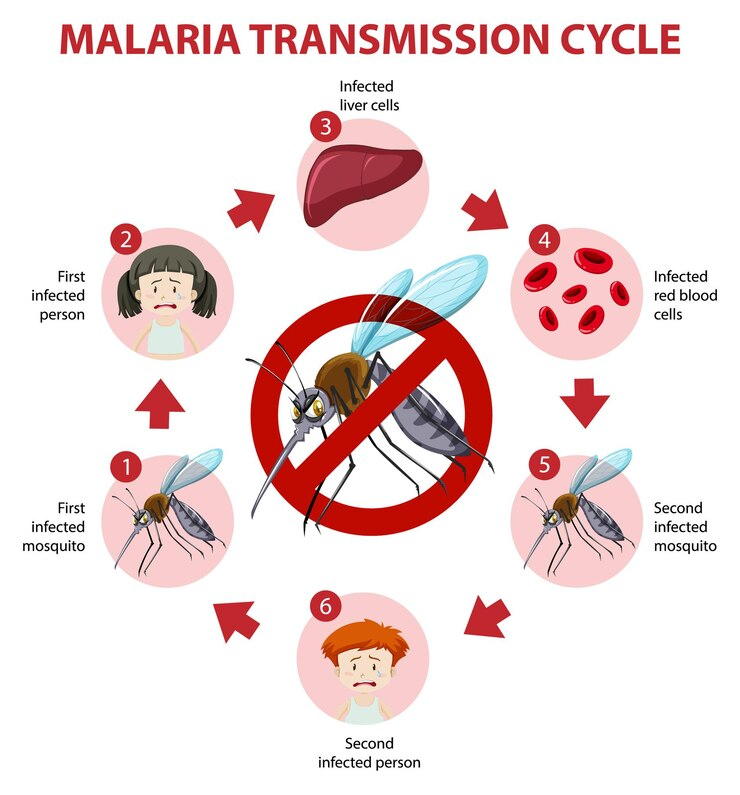
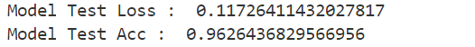
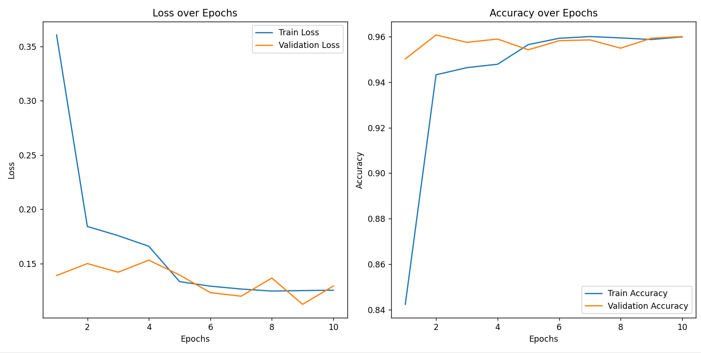
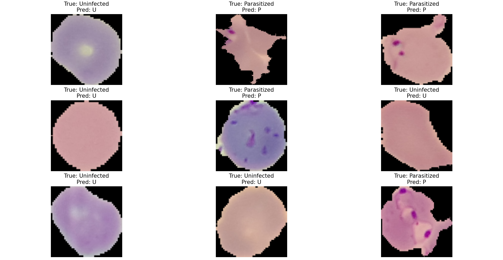

# Malaria-Classifier
This project implements a Malaria Classifier using a Convolutional Neural Network (CNN). The model is designed to classify cell images into two categories: Parasitized and Uninfected, based on microscopic images of red blood cells.

## What is Malaria?

Malaria is an infectious disease caused by parasites called Plasmodium and transmitted through mosquito bites. Carried by Anopheles mosquitoes, these parasites multiply in the liver after entering the human body and then attack red blood cells, causing disease.

**Symptoms:**

* High fever
* Chilling and sweating
* Headache
* Muscle pain
* Nausea and vomiting
* Treatment and Prevention:
* Malaria can be treated with antimalarial drugs. In areas where the disease is common, it is important to use insect repellents, bed nets and protective clothing to protect against mosquitoes. In addition, some vaccine studies are ongoing.

## Dataset

The dataset used for training the CNN model is the **[MALARIA](https://www.kaggle.com/datasets/iarunava/cell-images-for-detecting-malaria)** dataset, The dataset contains 2 folders Infected, Uninfected and a total of 27,558 images.

## Model Architecture

The model is based on a Convolutional Neural Network (CNN) that consists of the following layers:

1. **Convolutional layers** with ReLU activation functions.
2. **MaxPooling layers** for dimensionality reduction.
3. **Batch Normalization** for improving the model’s performance.
4. **Fully connected layers** with Dropout for regularization.
5. **Sigmoid output layer** to classify the input image into one of the binary results.

---
## Test Loss and Accuracy

## Results

---

## Predictions

The True Label and Predicted Label above the Image.

P = **Parasitized**
U = **Uninfected**

